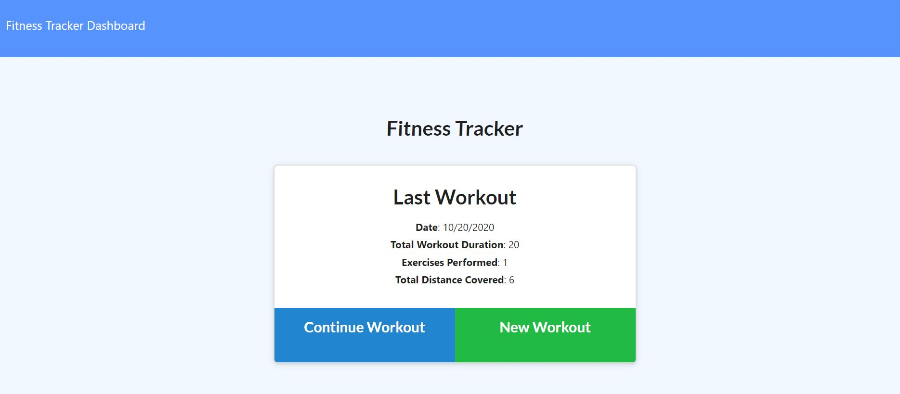

# workout-tracker

## Description
An application that uses MongoDB, Mongoose and Express to track the workouts to help achieve the personal goal.
## Table of Contents
* [Installation](#installation)
* [Usage](#usage)
* [License](#license)
* [Contributing](#contributing)
* [Tests](#tests)
* [Questions](#questions)
## Installation
This serach application is located at GitHub at  and the application can be accessed from [heroku](https://vk-fitness-tracker.herokuapp.com/)
## Usage
Clone the repository https://github.com/vkalaparthy/workout-tracker and run "npm install", to istall all the packages that are necessary to run the application. Since this application used MongoDB and Mongoose, make sure the Mongo is running in your environment.  Add the seeds by running "node seeds/seed.js" and then run "nodemon server.js".  The application in loacalhost will look like this:  

  

Or Run the app in Heroku, [here](https://vk-fitness-tracker.herokuapp.com/)  
Demo:  
 
## License
Copyright © 2020-present, Vani Kalaparthy. Released under the MIT License.
## Contributing
## Tests

## Questions
* Vani Kalaparthy
  * https://github.com/vkalaparthy
  * kalaparthy.vani@gmail.com
